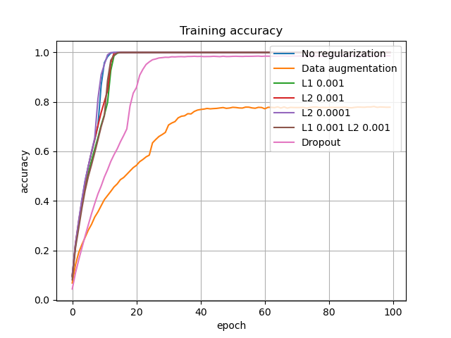
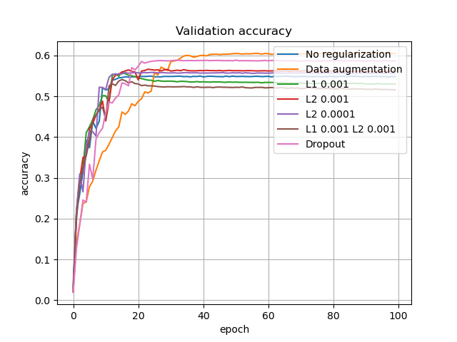
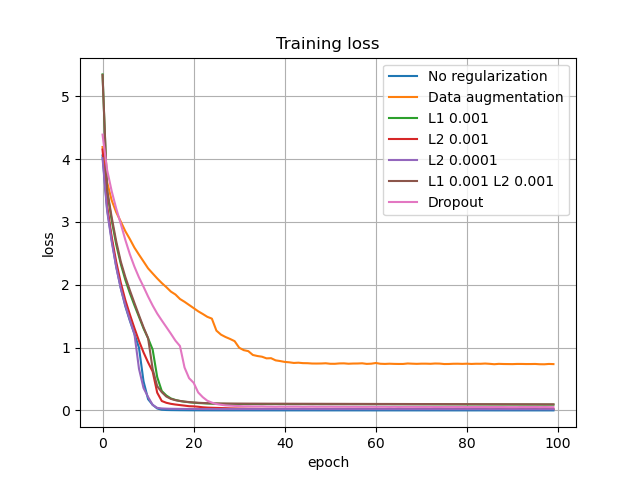

## ShuffleNetV2 Regularization
> Train ShuffleNetV2 on CIFAR-100 dataset with different regularization techniques

### Experiment results

**Test accuracy and loss**

|  Regularization   | Test loss | Test accuracy |
|:-----------------:|:---------:|:-------------:|
|       None        |  1.9833   |    0.5259     |
| Data augmentation |  1.5012   |    0.6087     |

**Learning curves**

### References
[keras-shufflenetV2](https://github.com/opconty/keras-shufflenetV2)

[ShuffleNet V2: Practical Guidelines for Efficient CNN Architecture Design](https://arxiv.org/abs/1807.11164)